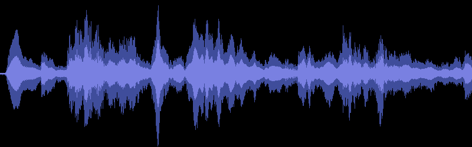
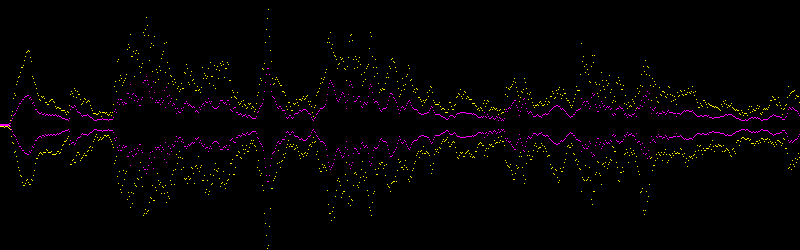

Waveformrs Waveform Image Generator 
===

A waveform generator for WAV files (Mp3 and FLAC support will be added)

Techs
===

* [Hound](https://github.com/ruuda/hound) A wav encoding library.
* [Image](https://github.com/PistonDevelopers/image) Encoding and decoding images in Rust.
* [Imageproc](https://github.com/PistonDevelopers/image) An image processing library based on the image library.
* [Serde](https://github.com/serde-rs/serde) Serialization framework.
* [Clap](https://github.com/kbknapp/clap-rs) A command line argument parser.


Prerequsities
===

Rust version 1.19 (rustc 1.19.0)

```bash
$ rustup update stable
```


Install
===

```bash
$ git clone https://github.com/azizunsal/waveformrs.git
$ cd waveformrs
$ cargo build --release
$ echo "export PATH=$PWD/target/release:\$PATH" > .waveformrs
$ source .waveformrs

```

Run
===

```bash
$ waveformrs --help
Waveform Generator 0.1.0
Aziz Unsal - unsal.aziz@gmail.com

USAGE:
    waveformrs [OPTIONS] --input <wav file name> --output <image file name>

FLAGS:
        --help       Prints help information
    -V, --version    Prints version information

OPTIONS:
    -h, --height <image-height>                     [default: 250]
    -w, --width <image-width>                       [default: 800]
    -i, --input <wav file name>                    Name of the wav file to be processed - full path.
    -o, --output <image file name>                 Name of the waveform image file to be generated.
    -s, --samples-per-pixel <samples per pixel>     [default: 256]
    -t, --theme <waveform-theme>                    [values: Dot, Line]
```

Usage
===

```bash

$ waveformrs -i ./resources/a2002011001-e02-16kHz.wav -o a2002011001-e02-16kHz.png
wav file summary has written to the 'a2002011001-e02-16kHz.json' file.
a2002011001-e02-16kHz.png successfully created.

```



### Running the same Wav file with `Dot` theme
```bash

$ waveformrs -i ./resources/a2002011001-e02-16kHz.wav -o a2002011001-e02-16kHz-dot.png -t Dot
wav file summary has written to the 'a2002011001-e02-16kHz-dot.json' file.
a2002011001-e02-16kHz-dot.png successfully created.

```




Wav File Data Overview
===

The processed WAV file summary can be found generated json file. This file will be used to send waveform data to the JavaScript application. 
Look at the excerpt below from a generated JSON file. The original file is here : `./examples/a2002011001-e02-16kHz.json`

```json

{
    "source_file": "./resources/a2002011001-e02-16kHz.wav",
    "sample_rate": 16000,
    "bits": 16,
    "samples_per_pixel": 256,
    "time_duration": 54.3115625,
    "processed_time_duration": 6.4008912787271658,
    "samples_length": 6788,
    "samples": [
        {
            "min": -1,
            "max": 49,
            "rms": 24.183947
        },
        {
            "min": -49,
            "max": 67,
            "rms": 28.996902
        },
        {
            "min": -101,
            "max": 73,
            "rms": 34.32445
        },
        {
            "min": -261,
            "max": 81,
            "rms": 87.58449
        },
        {
            "min": -347,
            "max": 0,
            "rms": 194.36104
        }

```


TODOs
---

- [ ] Mp3 and FLAC file support will be added.
- [ ] Waveform borders will be modified to give offset.
- [ ] Wav file time info added as an option to the generated image file.
- [ ] Just create waveform data options will be added to serve as a JavaScript waveform generator application backend.


